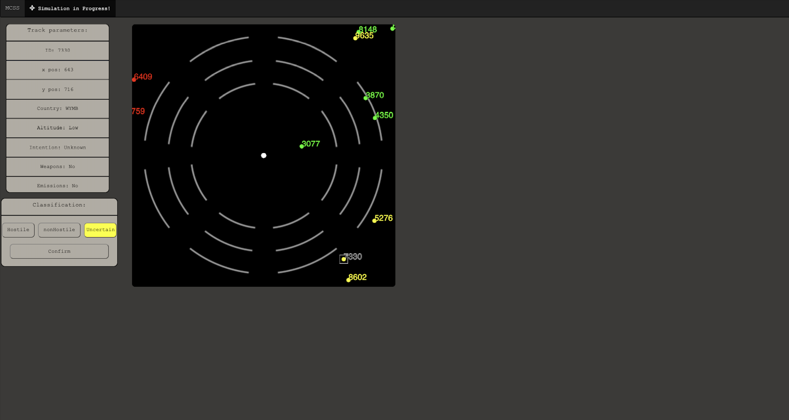

# MCCS(drone radar simulation)

## About
This program is inspired by inspired by the Micromonde combat control system developed by University of Laval.
It simulates three different drone radar systems with different changing accuracies and two test scenarios to aid get the user used to the system.
The program periodically links to external qualtrics questionaires that the user must respond in order to continue.

## Aim
The aim of this program is to measure users trust in the system when presented with the three different systems in different orders. The three different systems where divided in three different blocks, all of the first and third had 95 per cent accuracy and the second either 25,75,95. 

Three groups A,B,C where created to test users trust in the system with different accuracies. Group A had 95,95,95, Group B 95,25,95 and Group C 95,75,95. The users where asked to correct the systems classifications if necessary and where also periodically presented qualtrics questionaires such as a stress index and trust in system. Based on their classifications and the questionaires trust in the different groups was measured by psychologists using SPSS.
## System Features

### Three drone radar systems with dynamic accuracy levels
 
### Two test scenarios for training
- 
### Qualtrics questionnaire integration

## Prerequisites

Make sure you have Node.js and npm installed on your system. If not, download and install them from [Node.js official website](https://nodejs.org/).

## Installing

To set up the project locally, follow these steps:

### General

1. Clone the repository: `git clone https://github.com/your-username/MCSS.git`
2. Navigate to the project folder: `cd MCSS`
3. Install dependencies: `npm install`

### Environment Setup

1. Create a `.env` file in the root directory of your project.
2. Add the following line to set your `SESSION_SECRET`: 
    ```
    SESSION_SECRET=your_secret_here
    ```
    Replace `your_secret_here` with a strong, unique value.

3. To make the environment variables available during runtime, enter the following command in your terminal:
    ```
    export $(cat .env | xargs)
    ```
## Usage

1. Start the server: `npm run devStart`
2. Open a web browser and navigate to configured port in server.js file, you may have to change the default 5000 port
3. Follow the on-screen instructions to run the simulation and complete the questionnaires.


