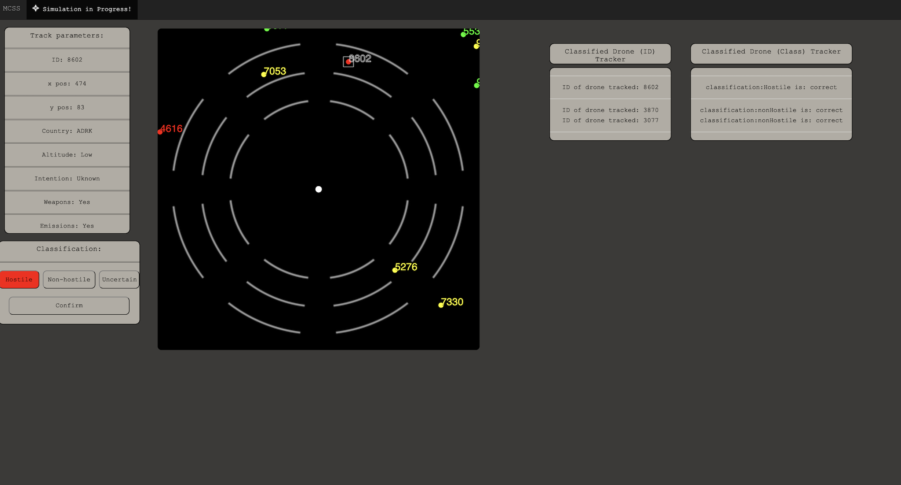
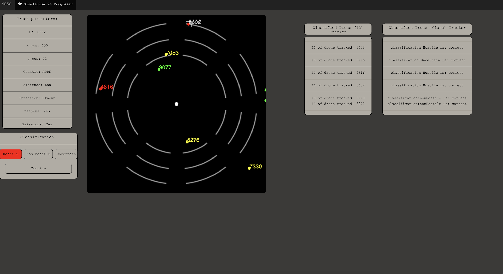
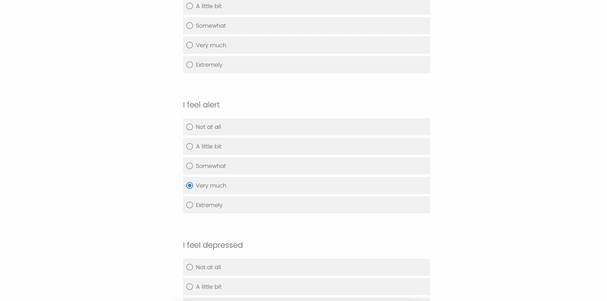

# 📡 MCCS(drone radar simulation)

## 📄 About
This program is inspired by the Micromonde combat control system developed by University of Laval. 
It simulates three different drone radar systems with dynamic accuracies and two test scenarios to help the user acclimate to the system.
The program periodically links to external Qualtrics questionnaires that the user must answer to proceed.

## 🎯 Aim
The objective of this program is to assess user trust in the system when presented with the three different systems in varying sequences. The three systems are divided into three blocks: the first and third have 95% accuracy, and the second can have 25%, 75%, or 95% accuracy.

Three groups A, B, C were formed to evaluate user trust in the system with varied accuracies. Group A was configured at 95-95-95, Group B at 95-25-95, and Group C at 95-75-95. Users were asked to rectify the system's classifications if needed and were periodically presented with Qualtrics questionnaires on stress indices and system trust. Psychologists then used SPSS to evaluate trust across the groups based on classifications and questionnaire responses.

## 🔧 System Features

### 🚁 Three drone radar systems with dynamic accuracy levels 
(here is one of the scenarios from Group A)
 
### 📋 Two test scenarios for training
 
 
### 📝 Qualtrics questionnaire integration


## 🛠️ Prerequisites

Make sure you have Node.js and npm 📦 installed on your system. If not, download and install them from [Node.js official website](https://nodejs.org/).

## 🚀 Installing

To set up the project on your local machine:

### General

1. 🖥️ Clone the repository: `git clone https://github.com/your-username/MCSS.git`
2. 📁 Navigate to the project folder: `cd MCSS`
3. ⬇️ Install dependencies: `npm install`

### 🌍 Environment Setup

1. 📄 Create a `.env` file in the root directory of your project.
2. 🔑 Add the following line to set your `SESSION_SECRET`: 
    ```
    SESSION_SECRET=your_secret_here
    ```
    Replace `your_secret_here` with a unique, strong value.

3. 🔄 To make the environment variables accessible during runtime, type this command:
    ```
    export $(cat .env | xargs)
    ```

## 🖥️ Usage

1. 🔥 Start the server: `npm run devStart`
2. 🌐 Open a browser and go to the configured port in server.js (default may be 5000).
3. 🧭 Follow the on-screen instructions to engage with the simulation and answer the questionnaires.
